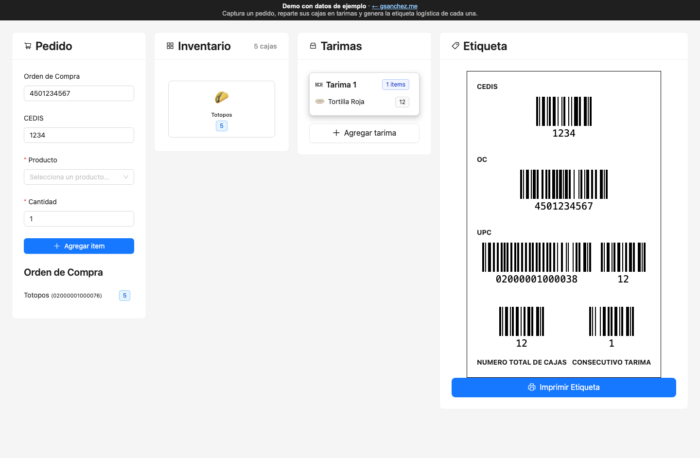

# App Tarimas

**Español** · [English](#english)

Aplicación web para armar las tarimas de un pedido e imprimir su etiqueta logística. Se captura la orden de compra, el CEDIS y los productos con su cantidad de cajas; las cajas se arrastran del inventario a cada tarima, y la app genera la etiqueta de cada tarima con los códigos de barras de CEDIS, orden de compra, GTIN y cantidad por producto, total de cajas y consecutivo.



**Demo con datos de ejemplo:** <https://gsanchez.me/demos/tarimas/>

## Uso local

```sh
npm ci && npm run dev
```

## Builds

| Comando | Qué genera |
|---|---|
| `npm run build` | La herramienta real, con los GTIN reales, para GitHub Pages. |
| `npx vite build --mode demo` | El demo (`.env.demo`): GTIN de ejemplo de circulación restringida GS1 (`02…`), CEDIS ficticio, banner de demo y base `/demos/tarimas/`. |

---

## English

A web app for building the pallets of an order and printing their logistics labels. You enter the purchase order, the distribution center (CEDIS) and the products with their box counts; drag the boxes from the inventory onto each pallet, and the app draws each pallet's label with barcodes for the CEDIS, purchase order, each product's GTIN and quantity, total boxes and pallet number.

**Demo with sample data:** <https://gsanchez.me/demos/tarimas/>

### Run locally

```sh
npm ci && npm run dev
```

### Builds

| Command | Output |
|---|---|
| `npm run build` | The real tool, with the real GTINs, for GitHub Pages. |
| `npx vite build --mode demo` | The demo (`.env.demo`): sample GS1 restricted-circulation GTINs (`02…`), a fictional CEDIS, a demo banner and base `/demos/tarimas/`. |
